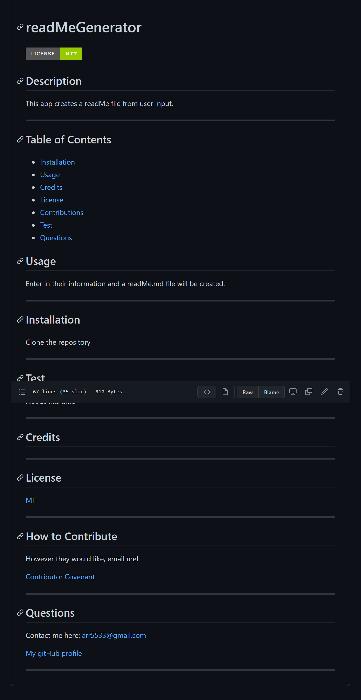

# readMeGenerator

## Description

This is a project I created for school to generate a markdown file to use as a README.MD. This page is made using Node.js and does not have a deployed page. As a student I was instructed to create an application that takes in user information to create a simple readMe file. Using the inquirer module I collected user information through prompts and using the file system module I generate a markdown file using the information provided by the user. There was a develop folder provided to me with the assignment and I myself only added to the functionality to the already defined functions in the index.js and generateMarkdown.js.

## Here is a video of the page to show you functionality

- otherwise there are GIFS of the functionality as well

https://user-images.githubusercontent.com/94136164/149424785-dcad73aa-e45e-44de-a9f5-94c4356e2f61.mp4

[Here is a link to the video](https://drive.google.com/file/d/13Nz8_R_inQrUMqGz-2fnOSf-J-hg10cJ/view "video of page")

_make sure to let it load for a few seconds before playing, google drive doesn't always give the best quality at first_

## GIFS of functionality

### Init application

### Generate readMe

### Basic function

## Screenshot of sample.md page created during video

_this file is also found_ [here](https://github.com/Amber-Robeck/readMeGenerator/blob/main/sample.md "Link to sample.md")
